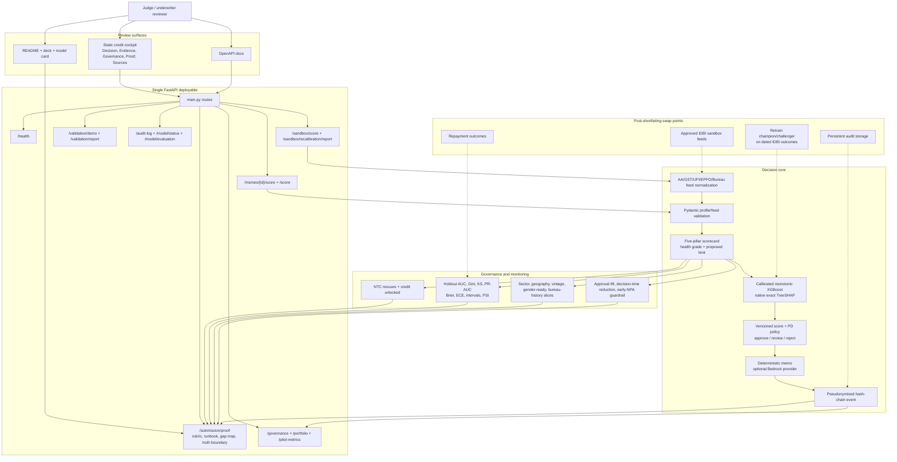

<div align="center">

# UdyamPulse

**Explainable MSME Financial Health Card for IDBI Innovate 2026 PS3.**

[Live demo](https://id-ysm9.onrender.com) |
[Submission deck](docs/deck/UdyamPulse-IDBI-Submission-Deck.pdf) |
[Walkthrough video](docs/demo.webm) |
[Model card](MODEL_CARD.md)

[](https://github.com/bansalbhunesh/id/actions/workflows/tests.yml)


Built for **IDBI Innovate 2026** - Problem Statement 3: Financial Health Score - Team **Looper**

</div>

---

## Table Of Contents

- [Overview](#overview)
- [Demo](#demo)
- [Backend Proof](#backend-proof)
- [Features](#features)
- [Architecture](#architecture)
- [Setup](#setup)
- [Evidence](#evidence)
- [Screenshots](#screenshots)
- [Judging Proof](#judging-proof)
- [Limitations](#limitations)

## Overview

UdyamPulse turns consented alternate-data signals into a bank-reviewable credit decision for thin-file MSMEs. The public prototype uses a synthetic cohort and sandbox-ready API contracts; it does not claim private IDBI data access.

The core demo moment is a New-to-Credit case traditional underwriting rejects because there is no bureau file. UdyamPulse approves the same business with a defensible Grade A health score, reason codes, Shapley attribution, policy guardrails, and an underwriter memo.

| Case | Traditional bureau-only | UdyamPulse alternate data |
|---|:---:|:---:|
| Shree Ganesh Textiles, no bureau file | Rejected | Approved - Grade A, Score 86/100 |
| Eligible credit limit | Rs 0 | Rs 27,00,000 |
| Explanation | No credit bureau history | Ranked reason codes, Shapley attribution, policy guardrails |

## Demo

- Live app: [https://id-ysm9.onrender.com](https://id-ysm9.onrender.com)
- Live API proof: [https://id-ysm9.onrender.com/submission/proof](https://id-ysm9.onrender.com/submission/proof)
- OpenAPI docs: [https://id-ysm9.onrender.com/docs](https://id-ysm9.onrender.com/docs)
- Walkthrough video: [docs/demo.webm](docs/demo.webm)
- Lightweight fallback: [docs/demo.gif](docs/demo.gif)
- Submission deck: [docs/deck/UdyamPulse-IDBI-Submission-Deck.pdf](docs/deck/UdyamPulse-IDBI-Submission-Deck.pdf)
- First-round rules check: [docs/FIRST_ROUND_RULES_CHECK.md](docs/FIRST_ROUND_RULES_CHECK.md)

What to verify in under three minutes:

1. Open the live app and keep the default Shree Ganesh Textiles case selected.
2. Compare `Traditional bureau-only: Rejected` with `UdyamPulse alternate data: Approved`.
3. Inspect the health-card pillars, reason codes, model attribution, decision path, and policy guardrails.
4. Switch to `Proof` and `Governance` to confirm audit, validation, pilot KPI, fairness, source-map, rubric, and competitor-gap proof.

## Backend Proof

The backend is not a mock response behind a polished screen. The judge can verify the product through live API surfaces:

| Proof surface | What it proves |
|---|---|
| `GET /submission/proof` | One payload summarizing the NTC reversal, truth boundary, backend capability map, judge runbook, rubric scorecard, competitor gap map, API catalog, validation metrics, controls, and Stage 2 swap points. |
| `GET /msmes/ntc_hero/score` | Full decision packet: score, grade, limit, reason codes, exact Shapley attribution, memo, guardrails, source map, and decision path. |
| `GET /model/evaluation` | Untouched proxy holdout AUC/Gini/KS/PR-AUC/Brier/ECE, bootstrap intervals, fairness slices, PSI, candidate comparison, and artifact hashes. |
| `POST /sandbox/score` | Underwriter-authenticated, purpose/scoped/expiry-checked AA/GST/UPI/EPFO/Bureau payloads normalize into the cockpit contract. |
| `POST /sandbox/recalibration/report` | Underwriter-authenticated sandbox distribution, coverage, labels, and retraining readiness evidence. |
| `POST /validation/report` | Underwriter-authenticated AUC, Gini, KS, PSI, and reason-code stability for caller-supplied dated cohorts. |
| `GET /governance` | Audit count, model status, live controls, fairness slices, pilot KPIs, and deployment caveats are inspectable. |

Quick backend checks:

```bash
curl https://id-ysm9.onrender.com/submission/proof
curl https://id-ysm9.onrender.com/msmes/ntc_hero/score
curl https://id-ysm9.onrender.com/governance
```

Rubric coverage is implemented as backend data, not only README copy:

| Judge lens | Verifiable proof |
|---|---|
| Innovation | NTC bureau rejection becomes an explainable alternate-data approval with memo, reasons, guardrails, and audit. |
| Feasibility | One FastAPI service, static cockpit, Dockerfile, Render Blueprint, GitHub Actions, and no mandatory paid API dependency. |
| Scalability | Separate ingestion, scoring, attribution, validation, audit, governance, and Stage 2 model swap points. |
| Business impact | Portfolio impact, NTC rescues, credit unlocked, pilot KPIs, early-risk guardrail, and diversification measures. |
| Technical implementation | Calibrated monotonic XGBoost, native exact TreeSHAP, logistic fallback, score/PD/policy separation, scoped APIs, and artifact-backed evidence. |
| Governance readiness | Honest random-holdout boundary, bootstrap intervals, proxy fairness slices, model-disagreement review, pseudonymised hash-chain audit, and deterministic memo fallback. |

## Features

- Underwriter cockpit with borrower queue, score, grade, risk band, credit-line recommendation, and decision comparison.
- Five-pillar financial health card: Liquidity, Discipline, Momentum, Leverage, and Digital Footprint.
- Calibrated monotonic XGBoost champion with native exact TreeSHAP, a calibrated logistic fallback, and an untouched 4,500-row public-proxy holdout -- not a regressor fit against a synthetic score. See [MODEL_CARD.md](MODEL_CARD.md).
- Deterministic underwriter memo and borrower improvement plan; optional AWS Bedrock memo generation is a Stage 2 configuration path.
- Underwriter/auditor role gates, source-scoped consent, security headers, rate limits, and restart-safe pseudonymised hash-chain audit events.
- Sandbox-ready ingestion via `POST /sandbox/score` for AA/GST/UPI/EPFO/Bureau-style payloads, with enforced purpose/scope/expiry consent.
- Recalibration and monitoring APIs for holdout AUC/Gini/KS/PR-AUC/Brier/ECE, bootstrap intervals, PSI, reason stability, pilot targets, and proxy fairness slices -- see `GET /model/evaluation`.

## Architecture



Important endpoints:

| Endpoint | Purpose |
|---|---|
| `GET /msmes` and `GET /msmes/{id}/score` | Demo cohort and score packets |
| `GET /submission/proof` | Judge-facing capability, architecture, rubric, runbook, competitor-gap, and truth-boundary proof |
| `POST /score` | Underwriter-authenticated custom MSME scoring |
| `POST /sandbox/score` | Normalize and score sandbox-style AA/GST/UPI/EPFO/Bureau payloads |
| `POST /sandbox/recalibration/report` | Profile sandbox distributions and readiness for GBM/SHAP |
| `GET /portfolio`, `/governance`, `/pilot-metrics` | Portfolio impact and control evidence |
| `GET /model/evaluation` | Champion/challenger selection, holdout metrics, uncertainty, fairness and artifact integrity |
| `GET /validation/demo`, `POST /validation/report` | Explicit fixture contract and authenticated caller-supplied cohort validation |
| `GET /audit-log`, `GET /model/status` | Auditor-gated pseudonymised trail and active champion metadata |

## Setup

```bash
cd backend
pip install -r requirements.txt
uvicorn main:app --reload
```

Open `http://localhost:8000`.

Demo-scoped credentials for protected write/audit routes are documented in [docs/DEMO_SCRIPT.md](docs/DEMO_SCRIPT.md); real deployments override `UDYAMPULSE_API_KEYS` and `UDYAMPULSE_AUDIT_HMAC_KEY`.

Run tests:

```bash
cd backend
pytest -q
```

Container deploy:

```bash
docker build -t udyampulse .
docker run -p 8000:8000 udyampulse
```

`Dockerfile` and `render.yaml` are included for a single-service Render deployment.

## Evidence

- Test suite: 50 tests covering scoring/policy routes, NTC reversal, model monotonicity, exact TreeSHAP reconstruction, artifact hashes, honest holdout evidence, bootstrap/fairness contracts, consent scope, protected writes, restart-safe pseudonymised audit chaining, and API proof.
- Model evidence: `GET /model/evaluation` reports random-holdout ROC-AUC **0.7497** (bootstrap 95% interval **0.7314-0.7678**), Gini **0.4993**, KS **0.4225**, PR-AUC **0.4948**, Brier **0.1415**, and ECE **0.0122**. It is reproducible with `python backend/model_training/train_pd_model.py` and explicitly not called OOT.
- Public cohort impact: 2 NTC rescues and Rs 30,80,000 credit unlocked in the synthetic demo cohort (pilot targets, not measured lift -- see `GET /pilot-metrics`).
- Governance evidence: policy guardrails with real consent-verification detail, source map, hash-chained audit count, real validation metrics, pilot KPI targets, and fairness slices are visible in the app.
- Backend evidence: `/submission/proof` exposes the capability map, judge runbook, route catalog, rubric scorecard, competitor gap map, architecture flow, real held-out validation metrics, controls, and Stage 2 swap points directly from backend functions.
- Security: custom/sandbox/validation writes require `underwriter`; `/audit-log` requires `auditor`; logs retain HMAC subject references rather than borrower names; CORS and consent scope are enforced. See [docs/SECURITY_COMPLIANCE.md](docs/SECURITY_COMPLIANCE.md).
- Model transparency: [MODEL_CARD.md](MODEL_CARD.md) documents the real training data/label, the domain-bridge feature mapping, explainability, intended use, and limitations. [docs/ARCHITECTURE.md](docs/ARCHITECTURE.md) documents module responsibilities, model versioning, and security boundaries.

## Screenshots

<table>
  <tr>
    <td width="50%" valign="top">
      
      <br />
      <strong>First viewport</strong><br />
      Judge path starts with one clear NTC rejection reversal, a top review index, and optional slide-over detail instead of a wall of boxes.
    </td>
    <td width="50%" valign="top">
      
      <br />
      <strong>Decision pack</strong><br />
      Half-page slide-over reveals the five-pillar health ledger, reason-code journal, memo, and improvement note on demand.
    </td>
  </tr>
  <tr>
    <td width="50%" valign="top">
      
      <br />
      <strong>Governance evidence</strong><br />
      Governance, validation, pilot KPIs, controls, and fairness slices stay inspectable without crowding the first viewport.
    </td>
    <td width="50%" valign="top">
      
      <br />
      <strong>Judge proof tab</strong><br />
      Rubric scorecard, truth boundary, competitor gap map, runbook, and backend API catalog pulled from `/submission/proof`.
    </td>
  </tr>
  <tr>
    <td width="50%" valign="top">
      
      <br />
      <strong>Mobile review</strong><br />
      Same borrower review flow compressed for a phone screen without hiding the decision evidence.
    </td>
    <td width="50%" valign="top">
      <strong>Full-resolution assets</strong><br />
      The gallery stays intentionally compact. Reviewers can open the PNGs in `docs/deck/assets/` for larger inspection.
    </td>
  </tr>
</table>

Full-resolution images remain in [docs/deck/assets](docs/deck/assets) for detailed inspection.

## Judging Proof

- Track fit: IDBI's public MSME Inclusion track asks for a Financial Health Card using alternate data for faster credit decisions and finance access for underserved MSMEs.
- Public event surface: the official public event venue found during review is [IDBI Innovate 2026 on Hack2skill](https://hack2skill.com/event/idbinnovate); no official IDBI Devpost page was found.
- Sandbox interpretation: public summaries indicate sandbox APIs, synthetic datasets, cloud resources, and mentorship are provided after shortlisting. This repo therefore ships synthetic proof data plus sandbox-ready ingestion, validation, recalibration, monitoring, and governance contracts.
- Differentiation: many PS3 demos stop at a score; UdyamPulse shows the bank decision pack around that score - rejection reversal, reasons, attribution, memo, source map, guardrails, audit, validation, pilot metrics, fairness checks, and a backend-verifiable judge proof endpoint.
- Competitive notes: [docs/COMPETITIVE_RESEARCH.md](docs/COMPETITIVE_RESEARCH.md)
- Submission checklist: [docs/SUBMISSION_CHECKLIST.md](docs/SUBMISSION_CHECKLIST.md)

## Limitations

- Public data is synthetic and illustrative; it is not IDBI customer, sandbox, or repayment-outcome data.
- The calibrated XGBoost champion is trained on a real default label from a public consumer-credit proxy, not Indian MSME outcomes. Its 4,500-row holdout is random and cross-sectional, not OOT; dated IDBI outcomes are still required.
- Gender and age monitoring is real on the untouched proxy holdout, but is not a production fairness certification. NTC/NTB, sector, geography and vintage outcome slices remain unavailable pending sandbox data.
- API authentication is a real, enforced bearer-token/role scheme sized for a public demo (no login flow or per-underwriter identity), not full IDBI SSO -- see docs/SECURITY_COMPLIANCE.md.
- AWS Bedrock memo generation is optional and requires configured credentials and a model ID; deterministic memo generation remains the default fallback.
- UdyamPulse is decision support for underwriters, not a fully automated approve/decline system without human review.
