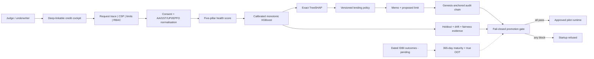
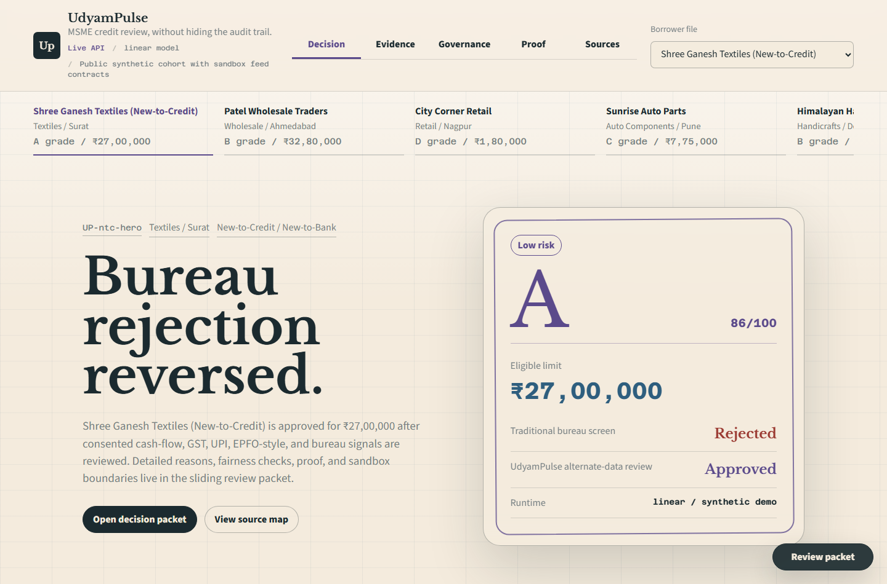
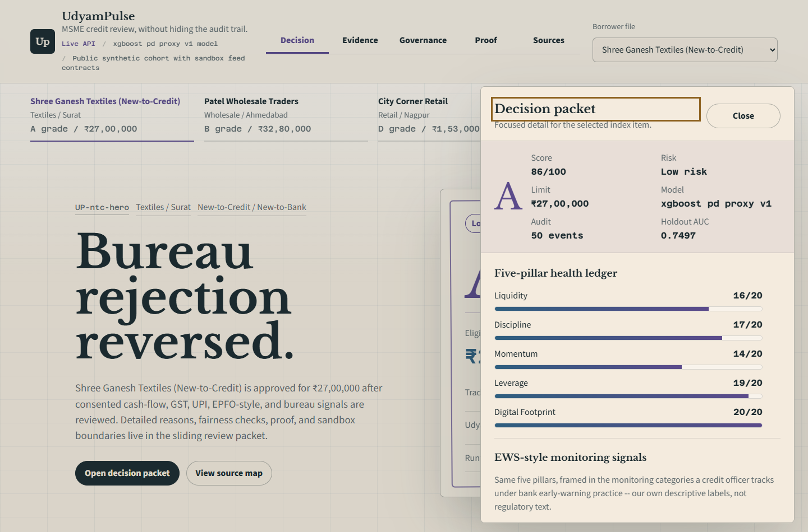
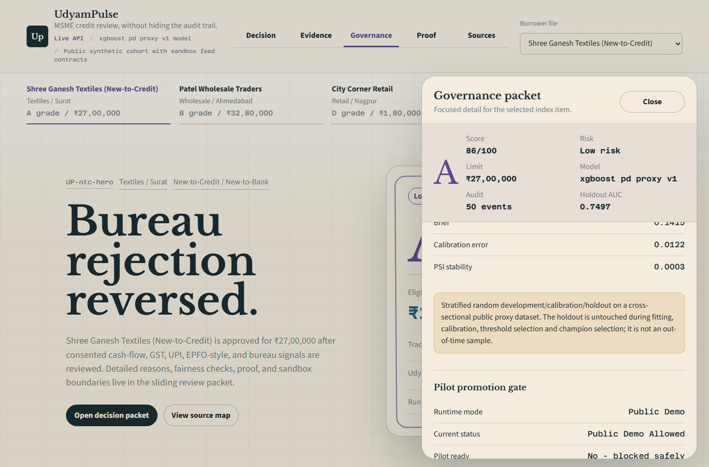
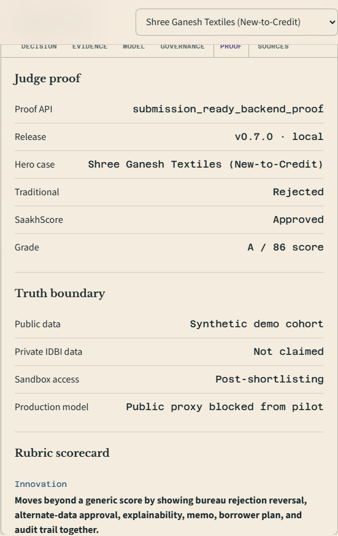
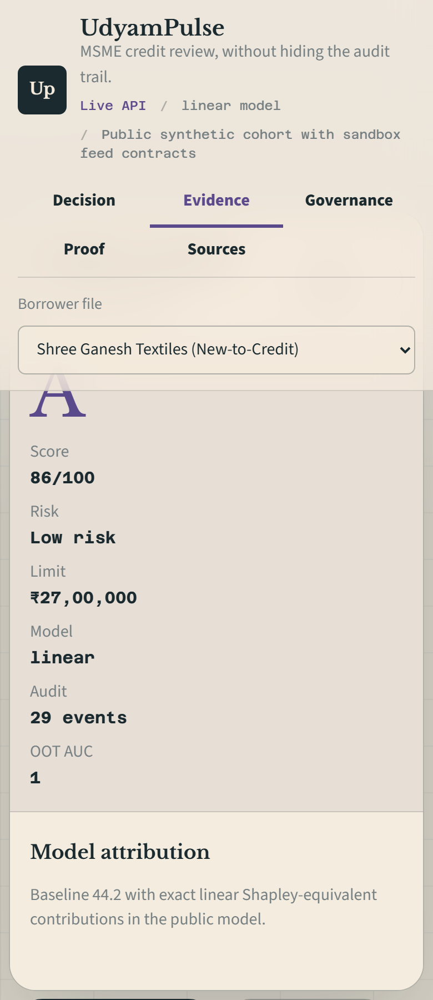

<div align="center">

# UdyamPulse

**Explainable MSME Financial Health Card for IDBI Innovate 2026 PS3.**

[Live demo](https://id-ysm9.onrender.com) |
[Submission deck](docs/deck/UdyamPulse-IDBI-Submission-Deck.pdf) |
[Animated walkthrough](docs/demo.gif) |
[Model card](MODEL_CARD.md) |
[Pilot runbook](docs/PILOT_RUNBOOK.md)

[](https://github.com/bansalbhunesh/id/actions/workflows/tests.yml)


[](LICENSE)

Built for **IDBI Innovate 2026** - Problem Statement 3: Financial Health Score - Team **Looper**

</div>

---

## Contents

- [Overview](#overview)
- [Demo](#demo)
- [Backend Proof](#backend-proof)
- [Features](#features)
- [Architecture](#architecture)
- [Setup](#setup)
- [Evidence](#evidence)
- [Screenshots](#screenshots)
- [Judging Proof](#judging-proof)
- [Limitations](#limitations)
- [License](#license)

## Overview

UdyamPulse turns consented alternate-data signals into a bank-reviewable credit decision for thin-file MSMEs. The public prototype uses a synthetic cohort and sandbox-ready API contracts; it does not claim private IDBI data access.

The core demo moment is a New-to-Credit case traditional underwriting rejects because there is no bureau file. UdyamPulse approves the same business with a defensible Grade A health score, reason codes, Shapley attribution, policy guardrails, and an underwriter memo.

| Case | Traditional bureau-only | UdyamPulse alternate data |
|---|:---:|:---:|
| Shree Ganesh Textiles, no bureau file | Rejected | Approved - Grade A, Score 86/100 |
| Indicative credit limit | Rs 0 | Rs 27,00,000 |
| Explanation | No credit bureau history | Ranked reason codes, Shapley attribution, policy guardrails |

## Demo

- Live app: [https://id-ysm9.onrender.com](https://id-ysm9.onrender.com)
- Live API proof: [https://id-ysm9.onrender.com/submission/proof](https://id-ysm9.onrender.com/submission/proof)
- OpenAPI docs: [https://id-ysm9.onrender.com/docs](https://id-ysm9.onrender.com/docs)
- Runtime readiness: [https://id-ysm9.onrender.com/health/ready](https://id-ysm9.onrender.com/health/ready)
- Animated walkthrough (browser-automation capture of the live app, current build): [docs/demo.gif](docs/demo.gif)
- Narration + click path + backend verification companion: [docs/DEMO_SCRIPT.md](docs/DEMO_SCRIPT.md)
- Submission deck: [docs/deck/UdyamPulse-IDBI-Submission-Deck.pdf](docs/deck/UdyamPulse-IDBI-Submission-Deck.pdf)
- First-round rules check: [docs/FIRST_ROUND_RULES_CHECK.md](docs/FIRST_ROUND_RULES_CHECK.md)
- Pilot promotion runbook: [docs/PILOT_RUNBOOK.md](docs/PILOT_RUNBOOK.md)
- Threat model: [docs/THREAT_MODEL.md](docs/THREAT_MODEL.md)

What to verify in under three minutes:

1. Open the live app and keep the default Shree Ganesh Textiles case selected.
2. Compare `Traditional bureau-only: Rejected` with `UdyamPulse alternate data: Approved`.
3. Inspect the health-card pillars, reason codes, model attribution, decision path, and policy guardrails.
4. Switch to `Proof` and `Governance` to confirm audit, validation, pilot KPI, fairness, source-map, rubric, and competitor-gap proof.

## Backend Proof

The backend is not a mock response behind a polished screen. The judge can verify the product through live API surfaces:

| Proof surface | What it proves |
|---|---|
| `GET /health/ready` | Release version, serving provider, runtime permission and verified artifact integrity used by container/Render readiness checks. |
| `GET /submission/proof` | One payload summarizing the NTC reversal, truth boundary, backend capability map, judge runbook, rubric scorecard, competitor gap map, API catalog, validation metrics, controls, and Stage 2 swap points. |
| `GET /msmes/ntc_hero/score` | Full decision packet: score, grade, limit, reason codes, exact Shapley attribution, memo, guardrails, source map, and decision path. |
| `GET /model/evaluation` | Untouched proxy holdout AUC/Gini/KS/PR-AUC/Brier/ECE, bootstrap intervals, fairness slices, PSI, candidate comparison, and artifact hashes. |
| `GET /model/sme-benchmark` | Real **SBA small-business** charge-off outcomes at natural base rates: v2 champion validated on a **true later-in-time OOT window** (114,770 loans) and a **recession stress cohort** (257,465 loans), plus the v1 case-sample baseline with its out-of-distribution test -- selective monotonicity, native exact TreeSHAP, per-artifact hashes, and committed honesty caveats. |
| `POST /sandbox/score` | Underwriter-authenticated, purpose/scoped/expiry-checked AA/GST/UPI/EPFO/Bureau payloads normalize into the cockpit contract. |
| `POST /sandbox/recalibration/report` | Underwriter-authenticated sandbox distribution, coverage, labels, and retraining readiness evidence. |
| `GET /sandbox/outcome-contract` | Machine-readable dated 12-month outcome schema, maturity rule, chronological split policy, and privacy boundary. |
| `POST /sandbox/pilot-readiness` | Underwriter-authenticated maturity, volume, temporal/OOT, source-coverage, NTC/NTB, and fairness-slice gates without record persistence. |
| `GET /deployment/readiness` | Fail-closed model and infrastructure promotion gates for pilot/production mode. |
| `POST /validation/report` | Underwriter-authenticated AUC, Gini, KS, PSI, and reason-code stability for caller-supplied dated cohorts. |
| `GET /governance` | Audit count, model status, live controls, fairness slices, pilot KPIs, and deployment caveats are inspectable. |

Quick backend checks:

```bash
curl https://id-ysm9.onrender.com/submission/proof
curl https://id-ysm9.onrender.com/health/ready
curl https://id-ysm9.onrender.com/msmes/ntc_hero/score
curl https://id-ysm9.onrender.com/governance
curl https://id-ysm9.onrender.com/deployment/readiness
```

Rubric coverage is implemented as backend data, not only README copy:

| Judge lens | Verifiable proof |
|---|---|
| Innovation | NTC bureau rejection becomes an explainable alternate-data approval with memo, reasons, guardrails, and audit. |
| Feasibility | One FastAPI service, zero-build static cockpit, non-root container, readiness probe, Render Blueprint, GitHub Actions, and no mandatory paid API dependency. |
| Scalability | Separate ingestion, scoring, attribution, O(n log n) validation, audit, temporal readiness, bounded payloads, and fail-closed promotion gates. |
| Business impact | Portfolio impact, NTC rescues, credit unlocked, pilot KPIs, early-risk guardrail, and diversification measures. |
| Technical implementation | Calibrated monotonic XGBoost, native exact TreeSHAP, logistic fallback, score/PD/policy separation, scoped APIs, and artifact-backed evidence. |
| Governance readiness | Honest random-holdout boundary, dated outcome contract, true-OOT readiness gates, model-disagreement review, pseudonymised audit, and fail-closed pilot promotion. |

## Features

- Deep-linkable, keyboard-accessible underwriter cockpit with borrower queue, score, grade, risk band, credit-line recommendation, and decision comparison.
- Five-pillar financial health card: Liquidity, Discipline, Momentum, Leverage, and Digital Footprint.
- Calibrated monotonic XGBoost champion with native exact TreeSHAP, a calibrated logistic fallback, and an untouched 4,500-row public-proxy holdout -- not a regressor fit against a synthetic score. See [MODEL_CARD.md](MODEL_CARD.md).
- Deterministic underwriter memo and borrower improvement plan; optional AWS Bedrock memo generation is a Stage 2 configuration path.
- EWS-style monitoring signals (bank-recognisable categories for the same five pillars) and a deterministic, rule-based underwriter next-best-action recommendation, both derived from the already-computed score -- not generative output.
- Underwriter/auditor role gates, source-scoped consent, strict app CSP, request IDs, body/array bounds, quota headers, and fsync-backed genesis-anchored pseudonymised audit events.
- Sandbox-ready ingestion via `POST /sandbox/score` for AA/GST/UPI/EPFO/Bureau-style payloads, with enforced purpose/scope/expiry consent. A source the caller never connects always routes to mandatory review instead of being silently scored as worst-case, and a counterparty-concentration guardrail flags heavy single-buyer dependency.
- **GST-vs-bank turnover reconciliation**: when both feeds are present, declared turnover is compared against bank-observed inflow; a divergence beyond +/-25% routes to review and becomes the underwriter's top next action -- the "looks-fine-on-paper" red flag, detected in both directions.
- **EMI-capacity indicative limit**: the limit is sized from spare debt-service capacity (existing-debt service estimated, policy rate/tenor annuity) and only *capped* by the grade multiple, with the full `limit_basis` breakdown in every response -- not a bare score-times-constant number.
- **Favorable-only conduct prior**: strong GST momentum and UPI footprint reduce the routed PD through a capped, disclosed expert prior (never inflating PD for thin digital visibility -- absence of signal is not evidence of risk); the coefficients become trainable the moment dated sandbox outcomes arrive.
- **Bilingual reason codes**: borrower-facing reasons, improvement actions, and the underwriter next-best-action ship in English and Hindi for the financial-inclusion audience.
- Recalibration and monitoring APIs for holdout AUC/Gini/KS/PR-AUC/Brier/ECE, bootstrap intervals, PSI, reason stability, pilot targets, and proxy fairness slices -- see `GET /model/evaluation`.
- Dated `bad_12m` outcome contract with 365-day maturity checks and automatic chronological development/calibration/OOT cohorts -- see `GET /sandbox/outcome-contract` and `POST /sandbox/pilot-readiness`.
- Explicit `public_demo`, `pilot`, and `production` modes. Pilot/production startup fails closed until private credentials, IDBI-scoped artifacts, true OOT evidence, and durable audit storage pass -- see `GET /deployment/readiness`.

## Architecture



<details>
<summary>Mermaid source (renders live on GitHub too; the image above is a committed fallback so the diagram never depends on a client-side renderer)</summary>



Regenerate the image after editing the source: save the block above to a `.mmd` file and run `mmdc -i file.mmd -o docs/diagrams/readme-architecture.svg`.

</details>

Important endpoints:

| Endpoint | Purpose |
|---|---|
| `GET /health/live`, `GET /health/ready` | Process liveness and release/model/artifact readiness |
| `GET /msmes` and `GET /msmes/{id}/score` | Demo cohort and score packets |
| `GET /submission/proof` | Judge-facing capability, architecture, rubric, runbook, competitor-gap, and truth-boundary proof |
| `POST /score` | Underwriter-authenticated custom MSME scoring |
| `POST /sandbox/score` | Normalize and score sandbox-style AA/GST/UPI/EPFO/Bureau payloads |
| `POST /sandbox/recalibration/report` | Profile sandbox distributions and readiness for GBM/SHAP |
| `GET /sandbox/outcome-contract`, `POST /sandbox/pilot-readiness` | Validate dated 12-month labels, maturity, chronological splits, NTC volume, and monitoring support |
| `GET /deployment/readiness` | Show and enforce model/identity/OOT/audit promotion blockers |
| `GET /portfolio`, `/governance`, `/pilot-metrics` | Portfolio impact and control evidence |
| `GET /model/evaluation` | Champion/challenger selection, holdout metrics, uncertainty, fairness and artifact integrity |
| `GET /validation/demo`, `POST /validation/report` | Explicit fixture contract and authenticated caller-supplied cohort validation |
| `GET /audit-log`, `GET /model/status` | Auditor-gated pseudonymised trail and active champion metadata |

## Setup

```bash
cd backend
pip install -r requirements.txt
uvicorn main:app --reload
```

Open `http://localhost:8000`.

Demo-scoped credentials for protected write/audit routes are documented in [docs/DEMO_SCRIPT.md](docs/DEMO_SCRIPT.md); real deployments override `UDYAMPULSE_API_KEYS` and `UDYAMPULSE_AUDIT_HMAC_KEY`.

Run tests:

```bash
python -m pytest backend -q
```

Container deploy:

```bash
docker build -t udyampulse .
docker run -d --name udyampulse -p 8000:8000 udyampulse
docker inspect --format='{{json .State.Health}}' udyampulse
```

The image runs as a non-root user and probes `/health/ready`. `Dockerfile` and `render.yaml` define the same single-service deployment used by Render.

## Evidence

- Test suite: 115 tests covering scoring/policy routes, NTC reversal, model monotonicity, exact TreeSHAP reconstruction, runtime artifact hashes, honest holdout evidence, consent-at-decision scope, temporal leakage/maturity/split gates, production-scale validation, resource ceilings, request traces, fail-closed runtime modes, writable non-root audit persistence, genesis-anchored audit chaining, missing-source review routing, counterparty-concentration limit sizing, GST-vs-bank divergence detection, EMI-capacity limit sizing, favorable-only conduct-prior bounds, bilingual reason codes, v2 benchmark integrity and leakage exclusions, side-effect-free public reads, separated underwriter/auditor duties, chunked-body limits, doc-figure consistency, generative-memo fact-checking, and API proof.
- Model evidence: `GET /model/evaluation` reports random-holdout ROC-AUC **0.7497** (bootstrap 95% interval **0.7314-0.7678**), Gini **0.4993**, KS **0.4225**, PR-AUC **0.4948**, Brier **0.1415**, and ECE **0.0122**. It is reproducible with `python backend/model_training/train_pd_model.py` and explicitly not called OOT.
- Real small-business outcome benchmark: `GET /model/sme-benchmark` serves the `sba_sme_pd_v2` champion -- selected across **418,947 resolved real SBA 7(a) loans at natural base rates** (197,716-loan train split) and validated on a **true later-in-time out-of-time window** (FY2017-19: 114,770 loans, ROC-AUC **0.9623**, KS **0.82**) and a **recession stress cohort** (257k loans, ROC-AUC **0.9255**), with selective monotonicity, exact TreeSHAP, bootstrap intervals, and a pre-registered significance+materiality selection gate. The earlier case-sample benchmark stays committed as the baseline. Reproduce via `backend/model_training/experiments/` + `train_sme_pd_model_v2.py`; the full experiment registry and analysis are in [docs/research/BENCHMARK_REPORT.md](docs/research/BENCHMARK_REPORT.md). Real outcomes, real time axis -- still a US proxy domain, complementary to the alternate-data conduct pillars, and explicitly not an IDBI production calibration.
- Public cohort impact: 2 NTC rescues and Rs 30,23,000 credit unlocked in the synthetic demo cohort (pilot targets, not measured lift -- these figures are computed by `GET /portfolio`, so the prose matches the live backend rather than drifting from it).
- Governance evidence: policy guardrails with real consent-verification detail, source map, hash-chained audit count, real validation metrics, pilot KPI targets, and fairness slices are visible in the app.
- Backend evidence: `/submission/proof` exposes the capability map, judge runbook, route catalog, rubric scorecard, competitor gap map, architecture flow, real held-out validation metrics, controls, and Stage 2 swap points directly from backend functions.
- Security: custom/sandbox/validation writes require `underwriter`; `/audit-log` requires `auditor`; logs retain HMAC subject references rather than borrower names; CSP, CORS, consent, payload ceilings and rate budgets are enforced. See [docs/SECURITY_COMPLIANCE.md](docs/SECURITY_COMPLIANCE.md) and [docs/THREAT_MODEL.md](docs/THREAT_MODEL.md).
- Promotion safety: the live public proxy is explicitly blocked from pilot use. `UDYAMPULSE_MODE=pilot` or `production` refuses startup until all machine-readable deployment gates pass.
- Model transparency: [MODEL_CARD.md](MODEL_CARD.md) documents the real training data/label, domain bridge, explainability, intended use and limitations. [docs/ARCHITECTURE.md](docs/ARCHITECTURE.md) documents implementation boundaries; [docs/PILOT_RUNBOOK.md](docs/PILOT_RUNBOOK.md) defines promotion, sign-off and rollback.

## Screenshots

<table>
  <tr>
    <td width="50%" valign="top">
      
      <br />
      <strong>First viewport</strong><br />
      Judge path starts with one clear NTC rejection reversal, a top review index, and optional slide-over detail instead of a wall of boxes.
    </td>
    <td width="50%" valign="top">
      
      <br />
      <strong>Decision pack</strong><br />
      Half-page slide-over reveals the five-pillar health ledger, reason-code journal, memo, and improvement note on demand.
    </td>
  </tr>
  <tr>
    <td width="50%" valign="top">
      
      <br />
      <strong>Governance evidence</strong><br />
      The public proxy boundary and five blocking pilot gates are visible before any reviewer could mistake demo evidence for bank validation.
    </td>
    <td width="50%" valign="top">
      
      <br />
      <strong>Judge proof tab</strong><br />
      Rubric scorecard, truth boundary, competitor gap map, runbook, and backend API catalog pulled from `/submission/proof`.
    </td>
  </tr>
  <tr>
    <td width="50%" valign="top">
      
      <br />
      <strong>Mobile review</strong><br />
      Same borrower review flow compressed for a phone screen without hiding the decision evidence.
    </td>
    <td width="50%" valign="top">
      <strong>Full-resolution assets</strong><br />
      The gallery stays intentionally compact. Reviewers can open the PNGs in `docs/deck/assets/` for larger inspection.
    </td>
  </tr>
</table>

Full-resolution images remain in [docs/deck/assets](docs/deck/assets) for detailed inspection.

## Judging Proof

- Track fit: IDBI's public MSME Inclusion track asks for a Financial Health Card using alternate data for faster credit decisions and finance access for underserved MSMEs.
- Public event surface: the official public event venue found during review is [IDBI Innovate 2026 on Hack2skill](https://hack2skill.com/event/idbinnovate); no official IDBI Devpost page was found.
- Sandbox interpretation: the official schedule says shortlist results arrive July 21 and finalists receive sandbox access July 22-31. This repo therefore ships synthetic proof plus a ready feed contract, dated outcome schema, automatic temporal/OOT readiness analysis, and fail-closed promotion controls without claiming early access.
- Differentiation: many PS3 demos stop at a score; UdyamPulse shows the bank decision pack around that score - rejection reversal, reasons, attribution, memo, source map, guardrails, audit, validation, pilot metrics, fairness checks, and a backend-verifiable judge proof endpoint.
- Competitive notes: [docs/COMPETITIVE_RESEARCH.md](docs/COMPETITIVE_RESEARCH.md)
- Model roadmap (real-outcome benchmark + two-tower plan): [docs/MSME_MODEL_ROADMAP.md](docs/MSME_MODEL_ROADMAP.md)
- Submission checklist: [docs/SUBMISSION_CHECKLIST.md](docs/SUBMISSION_CHECKLIST.md)

## Limitations

- Public data is synthetic and illustrative; it is not IDBI customer, sandbox, or repayment-outcome data.
- The calibrated XGBoost champion is trained on a real default label from a public consumer-credit proxy, not Indian MSME outcomes. Its 4,500-row holdout is random and cross-sectional, not OOT; dated IDBI outcomes are still required.
- Gender and age monitoring is real on the untouched proxy holdout, but is not a production fairness certification. NTC/NTB, sector, geography and vintage outcome slices remain unavailable pending sandbox data.
- API authentication is a real, enforced bearer-token/role scheme sized for a public demo (no login flow or per-underwriter identity), not full IDBI SSO -- see docs/SECURITY_COMPLIANCE.md.
- Pilot mode is intentionally not ready today: `/deployment/readiness` blocks it on public-proxy model scope, absent true OOT evidence, demo credentials/HMAC, and local JSONL audit storage.
- AWS Bedrock memo generation is optional and requires configured credentials and a model ID; deterministic memo generation remains the default fallback.
- UdyamPulse is decision support for underwriters, not a fully automated approve/decline system without human review.

## License

MIT - see [LICENSE](LICENSE). The public synthetic cohort, model artifacts, and documentation in this repository are covered by the same terms; this does not extend to any IDBI, AA, GST, UPI, or EPFO data or credentials, which are never present in this codebase.
