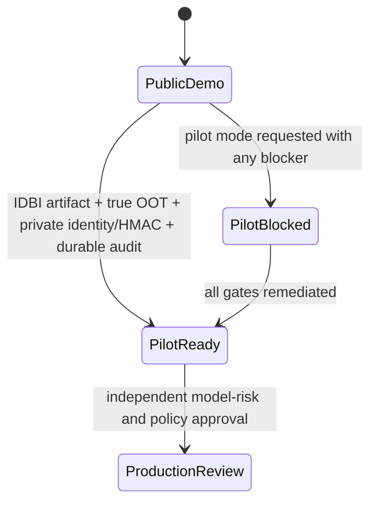

# Architecture

## Runtime

One Python 3.12 Docker service runs FastAPI and serves the static review cockpit. The zero-build frontend and API stay same-origin; API route definitions are mounted before `StaticFiles`.

```mermaid
flowchart LR
  User["Judge / underwriter"] --> UI["Static review cockpit"]
  UI --> Public["Public synthetic GET routes"]
  User --> Auth["Bearer role check"]
  Auth --> Write["Custom / sandbox / validation writes"]
  Write --> Consent["Purpose + scope + expiry consent"]
  Write --> Outcomes["Dated 12-month pilot outcomes"]
  Outcomes --> Maturity["365-day maturity + duplicate/leakage checks"]
  Maturity --> Temporal["Chronological development / calibration / OOT"]
  Public --> Score["Five-pillar health score"]
  Consent --> Score
  Score --> PD["Calibrated XGBoost champion"]
  PD --> SHAP["Native exact TreeSHAP"]
  SHAP --> Policy["Policy v2: approve / review / reject"]
  Policy --> Memo["Deterministic memo / optional Bedrock"]
  Memo --> Audit["Pseudonymised SHA256 event chain"]
  PD --> Evidence["Holdout metrics + intervals + fairness + PSI"]
  Audit --> Governance["Governance and submission proof"]
  Evidence --> Governance
  Temporal --> Promotion["Model + infrastructure promotion gates"]
  Audit --> Promotion
  Promotion -->|"all pass"| Pilot["Pilot / production runtime"]
  Promotion -->|"any block"| Stop["Fail-closed startup"]
```

## Decision Contract

UdyamPulse intentionally avoids one opaque “AI score”:

1. `scoring.py` computes five descriptive pillars, grade and proposed limit.
2. `ml.py` loads the committed champion manifest and returns PD plus exact attribution.
3. `apply_decision_policy` combines grade and the calibrated PD review threshold.
4. The public proxy may route an A/B disagreement to review, but cannot auto-decline.
5. Grade C is always reviewed; D/E remains a transparent scorecard-policy decline.

## Champion/Challenger Training

`model_training/train_pd_model.py` verifies the 30,000-row source hash, creates development/calibration/holdout splits, fits calibrated logistic and monotonic XGBoost candidates, selects on calibration, and evaluates once on holdout. It writes:

| Artifact | Purpose |
|---|---|
| `artifact.json` | Calibrated logistic fallback |
| `xgboost_model.json` | Monotonic XGBoost trees |
| `xgboost_metadata.json` | Calibration and exact TreeSHAP contract |
| `champion.json` | Serving provider, threshold and artifact map |
| `evaluation.json` | Candidate comparison, holdout metrics, intervals, fairness, PSI, gaps and hashes |

The cross-sectional source cannot provide OOT validation. `evaluation.json` states this explicitly and reserves the term OOT for future dated IDBI outcomes.

## Module Map

| Module | Responsibility |
|---|---|
| `main.py` | Routes, role wiring, CORS, rate limits, security headers and static mount |
| `auth.py` | API-key role hierarchy |
| `feed_ingestion.py` | AA/GST/UPI/EPFO/Bureau contracts and consent enforcement |
| `pilot_readiness.py` | Dated outcome schema, maturity checks, chronological splits, segment/source gates and privacy-safe report |
| `deployment_gate.py` | Runtime modes and fail-closed model/identity/OOT/audit promotion policy |
| `scoring.py` | Health score, proposed limit, decision policy, reasons and guardrails |
| `feature_bridge.py` | Explicit MSME-to-universal risk mapping |
| `ml.py` | Champion loading, fallback, PD and explanation response |
| `xgb_pd_model.py` | XGBoost inference and exact calibrated TreeSHAP reconstruction |
| `pd_model.py` | Calibrated dependency-free logistic fallback and exact linear Shapley |
| `model_training/` | Offline training, metrics, selection, uncertainty and fairness evidence |
| `audit_log.py` | HMAC pseudonyms, restart-safe persistence, migration and hash chain |
| `portfolio.py` | Synthetic portfolio views, public redaction and governance controls |
| `submission_proof.py` | Judge-facing proof assembled from live backend state |

## Security Boundaries

| Boundary | Enforcement |
|---|---|
| Public browser to sample data | Fixed synthetic GET responses only |
| Caller data to API | Underwriter bearer role, rate limit and Pydantic validation |
| Sandbox sources to scoring | Active purpose-bound consent with complete source scope |
| Audit reader | Auditor role |
| Audit subject identity | HMAC pseudonym; no raw borrower name retained |
| Historical event mutation | SHA256 chain verified after restart and on governance reads |
| Model evidence | Dataset/artifact hashes and deterministic retraining command |
| Public proxy to bank pilot | Startup block until artifact scope, true OOT, private credentials/HMAC and durable audit storage pass |
| Pilot outcome upload | Underwriter role, in-memory analysis only, no returned identifiers, explicit 365-day maturity |

## Stage 2 Swap Points

- Replace the public proxy loader with approved dated IDBI MSME outcomes while preserving the universal serving contract.
- Supply approved dated records to the implemented outcome contract; the service now constructs true temporal development/calibration/OOT windows and blocks insufficient NTC/NTB or monitoring slices.
- Calibrate policy thresholds to IDBI loss economics and early-NPA guardrails.
- Replace demo API keys with IDBI SSO and JSONL with a durable WORM-capable audit store.
- Enable Bedrock only behind approved prompts, output schema checks and the deterministic fallback.

## Promotion State Machine

The current repository remains in `PublicDemo`. It cannot enter `PilotReady` with the committed public-proxy manifest.
