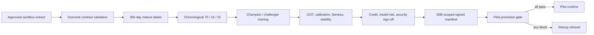

# Pilot Promotion Runbook

This runbook defines how UdyamPulse moves from the public demonstration into an approved IDBI sandbox pilot. It is an engineering control document, not evidence that a pilot has already been authorised.

## Promotion Principle

The public service cannot become a pilot through configuration alone. Promotion requires new bank-approved data evidence, a newly scoped model artifact, private identity and audit controls, and independent sign-off.



## Required Inputs

| Input | Minimum contract | Owner |
|---|---|---|
| Decision-time features | Consented AA/GST/UPI/EPFO/Bureau payload matching `IDBISandboxPayload` | Data engineering / AA integration |
| Outcome | Bank-approved `bad_12m` definition with `decision_at` and `observation_end_at` | Credit policy / collections |
| Maturity | Observation endpoint at least 365 days after decision | Model risk |
| Volume | 1,500 mature records; 1,000 development; 200 calibration; 200 OOT | Model development |
| Inclusion | At least 100 NTC/NTB records | MSME credit |
| Monitoring | At least two supported groups per required dimension, 50 records per group | Fair lending / model risk |
| Source quality | At least 80% average source coverage | Data governance |

These are code defaults for readiness, not IDBI-approved policy thresholds. IDBI may raise them.

## 1. Validate The Contract

Inspect the machine-readable schema:

```bash
curl https://id-ysm9.onrender.com/sandbox/outcome-contract
```

Run readiness only inside the approved environment. The endpoint is underwriter-gated, processes records in memory, persists none of the submitted payloads, and returns no application identifiers.

```bash
curl -X POST "$UDYAMPULSE_URL/sandbox/pilot-readiness" \
  -H "Authorization: Bearer $UDYAMPULSE_UNDERWRITER_KEY" \
  -H "Content-Type: application/json" \
  --data-binary @pilot-outcomes.json
```

Do not move data to the public Render deployment. Use the same container in an IDBI-approved network and storage boundary.

## 2. Freeze Temporal Cohorts

The readiness response must report `ready_for_temporal_training`. Preserve the generated date boundaries and dataset hash in the training evidence package.

- Development: earliest 70%; fitting only.
- Calibration: next 15%; calibration, threshold selection and champion selection.
- OOT: latest 15%; opened once for final evidence.
- Random shuffling: prohibited.

Any duplicate application, immature label, missing outcome class, or consent invalid at the original decision date blocks the run.

## 3. Train And Validate

Use the shipped pipeline as the reproducible baseline:

```bash
pip install -r backend/model_training/requirements-training.txt
python backend/model_training/train_pd_model.py
python -m pytest backend -q
```

The bank-data job must replace the public UCI loader, retain deterministic seeds and artifact hashing, and produce at minimum:

- OOT AUC, Gini, KS, PR-AUC, Brier and calibration error;
- bootstrap confidence intervals;
- PSI and source-coverage drift;
- reason-code stability;
- NTC/NTB, sector, geography, vintage, gender where available, and bureau-history slices;
- champion/challenger comparison and policy-threshold rationale;
- early-NPA guardrail definition approved by Credit.

## 4. Write The Promotion Manifest

Only the approved artifact may declare:

```json
{
  "deployment_scope": "idbi_pilot",
  "temporal_validation": "true_oot"
}
```

Regenerate `evaluation.json` after writing the manifest so every artifact hash remains linked. A hash mismatch is a startup blocker.

## 5. Configure The Pilot Runtime

Required deployment configuration:

| Variable | Requirement |
|---|---|
| `UDYAMPULSE_MODE` | `pilot` |
| `UDYAMPULSE_API_KEYS` | Private role credentials; no published demo keys |
| `UDYAMPULSE_AUDIT_HMAC_KEY` | KMS/Vault-managed deployment secret |
| `UDYAMPULSE_AUDIT_BACKEND` | `managed_append_only` or `postgres_worm` |
| `UDYAMPULSE_ALLOWED_ORIGINS` | Approved bank origins only |
| `UDYAMPULSE_MAX_BODY_BYTES` | Approved API-gateway and service payload ceiling |
| `UDYAMPULSE_MEMO_PROVIDER` | `deterministic` unless Bedrock is separately approved |

Confirm `GET /deployment/readiness` has no blockers before changing runtime mode. Pilot startup will fail closed otherwise.

## 6. Release, Observe, Roll Back

Pre-release checks:

1. `GET /health/live` returns the expected release commit.
2. `GET /health/ready` reports the approved model provider and passing artifact integrity.
3. Authentication, consent, rate-limit, payload-limit and audit tests pass.
4. A shadow decision is reconstructed from source inputs through memo and audit event.
5. Model Risk, Credit Policy, Information Security and Data Governance record sign-off.

Rollback triggers include artifact-integrity failure, missing audit writes, material PSI, calibration breach, reason-code instability, fairness guardrail breach, or early-NPA threshold breach. Roll back the serving artifact and policy together; do not silently change only the decision threshold.

## Evidence Package

Retain the immutable dataset manifest, source-to-feature mapping, training logs, artifact hashes, OOT report, fairness report, policy approval, deployment manifest, access review, rollback result and signed audit export. The public README and screenshots are not substitutes for this package.
