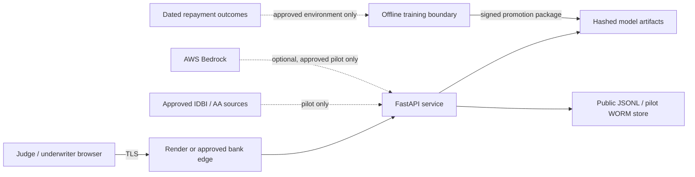

# Threat Model

## Scope And Status

This model covers the public UdyamPulse prototype and the controls required before an IDBI sandbox pilot. It is not a certification, DPIA, penetration test, or legal opinion. The public deployment contains fixed synthetic MSME cases and a public proxy model; it must not receive real customer data.

## Assets

1. Decision-time financial signals and consent artefacts.
2. Model artifacts, calibration parameters and lending policy.
3. Decision explanations, proposed limits and underwriter memos.
4. Pseudonymised audit events and chain integrity.
5. Role credentials, HMAC keys and optional Bedrock credentials.
6. Dated repayment outcomes and validation evidence.

## Trust Boundaries

Mermaid source (renders live on GitHub too; the image above is a committed fallback so the diagram never depends on a client-side renderer)

Regenerate the image after editing the source: save the block above to a `.mmd` file and run `mmdc -i file.mmd -o diagrams/threat-model-trust-boundaries.svg`.

## Threat Register

| Threat | Current control | Residual risk / pilot action |
|---|---|---|
| Broken function-level authorisation | Underwriter/auditor/admin role hierarchy on every caller-data and audit route | Replace public API keys with IDBI OIDC/SSO, branch/user claims, rotation and revocation |
| Excessive payload or request volume | Pydantic bounds, 8 MiB declared-body limit, endpoint-specific sliding windows, retry headers | Enforce gateway body limits, distributed quotas, concurrency limits and abuse alerts |
| Sensitive data leakage | Fixed synthetic public GETs; protected writes; audit stores HMAC subject references, not names; JSON responses are `no-store` | Approved field classification, DLP, log redaction tests and retention/deletion policy |
| Consent misuse | Purpose, scope, status, grant/expiry, duration and decision-time validity checks | Validate signed consent artefact and revocation against the approved consent manager |
| Model artifact substitution | SHA256 links for champion, fallback, metadata and evaluation; hashes checked at runtime | Signed artifacts, restricted registry, two-person promotion and provenance attestation |
| Cross-domain model misuse | Public artifact scope and random-holdout status block pilot startup | Retrain on dated IDBI outcomes and obtain independent model-risk validation |
| Audit history rewriting | Genesis-anchored SHA256 chain, restart verification, fsync on append, auditor-only read | WORM-capable shared store, signed exports, retention lock and external timestamping |
| Browser injection or framing | Strict application CSP, external script denial, frame denial, `nosniff`, no-referrer, permissions policy | Automated dependency scanning and penetration test in the approved deployment |
| Credential disclosure | No secrets returned by readiness APIs; demo keys explicitly identified | KMS/Vault storage, short-lived identity, rotation, access reviews and incident response |
| Unsafe generative memo | Deterministic memo is default and fallback | Bedrock only with approved model, prompt, schema validation, redaction and output monitoring |
| Temporal leakage | Observation-after-decision, 365-day maturity, duplicate rejection and chronological no-shuffle split | Independent data-lineage review and locked OOT cohort |
| Availability failure | Liveness/readiness separation, container health check, bounded work and fallback model | Multi-instance deployment, durable dependencies, SLOs, alerting and tested failover |

## Abuse Cases To Test

- Submit a valid token with an unauthorised role.
- Omit consent, remove a supplied feed from consent scope, or use consent invalid at decision time.
- Send oversized lists, long reason arrays, malformed JSON and a declared body above the service limit.
- Tamper with the first, middle or final audit event and restart the service.
- Replace a model artifact without regenerating evaluation hashes.
- Start `pilot` with demo credentials, public model scope, random holdout or local JSONL audit.
- Navigate the complete cockpit using keyboard only and attempt to move focus behind the open review packet.
- Make governance, proof or model-evidence endpoints unavailable while retaining the core borrower decision.

## Data Lifecycle

The public sample cohort is source-controlled synthetic data. Caller-supplied scoring payloads are validated and scored in process; the prototype does not persist them as records. The pilot-readiness endpoint processes submitted records in memory and returns aggregate counts without application IDs. Decision audit events retain pseudonymised decision metadata, not raw feed payloads.

Before pilot, IDBI must approve collection purpose, legal basis, data location, encryption/key ownership, retention, deletion, access review and incident handling. UdyamPulse documents technical alignment but does not claim compliance certification.

## References

- [RBI Handbook on Regulations at a Glance, 2025](https://website.rbi.org.in/documents/d/rbi/handbookg27022025d0f3f53f5d3c4310a6bb2f8ac2175d3a)
- [OWASP API Security Top 10 - API4:2023 Unrestricted Resource Consumption](https://owasp.org/API-Security/editions/2023/en/0xa4-unrestricted-resource-consumption/)
- [W3C WAI-ARIA modal dialog pattern](https://www.w3.org/WAI/ARIA/apg/patterns/dialog-modal/)
